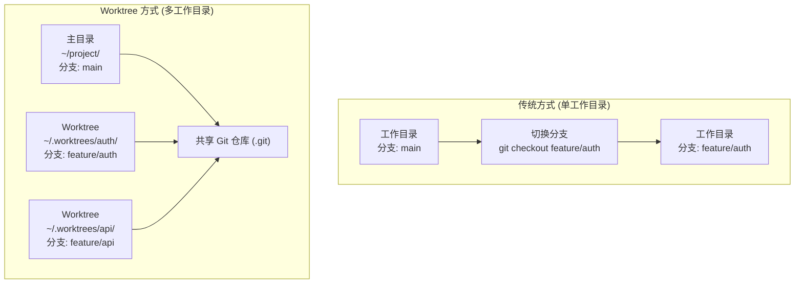
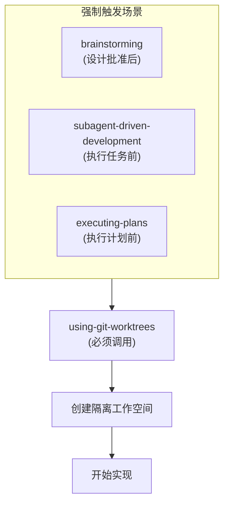
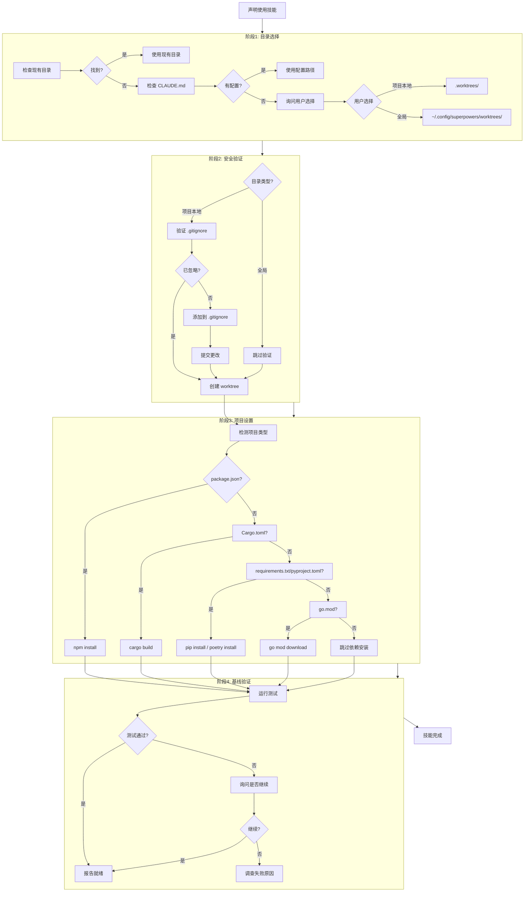
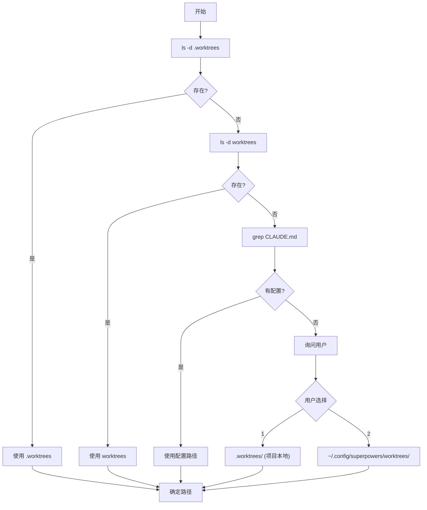
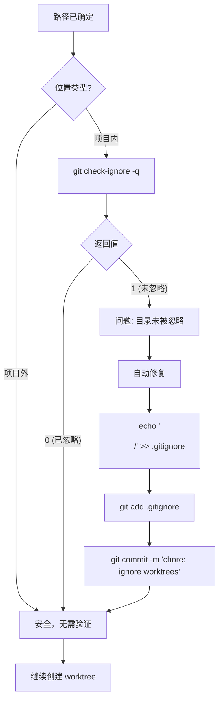
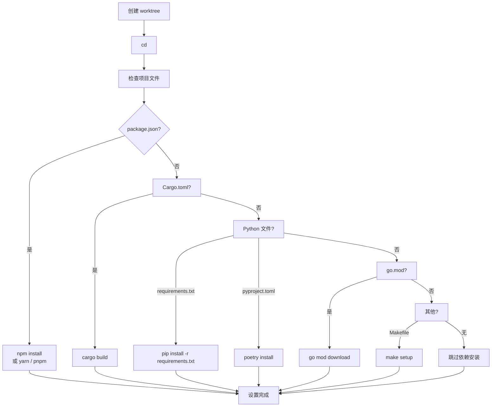
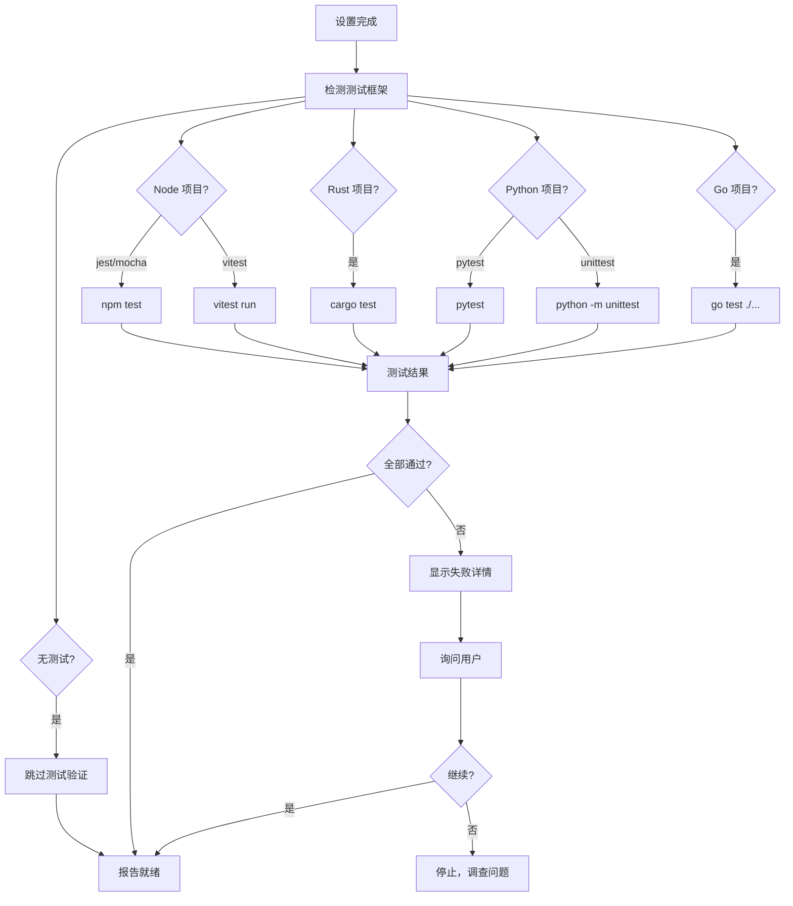
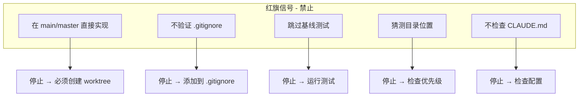
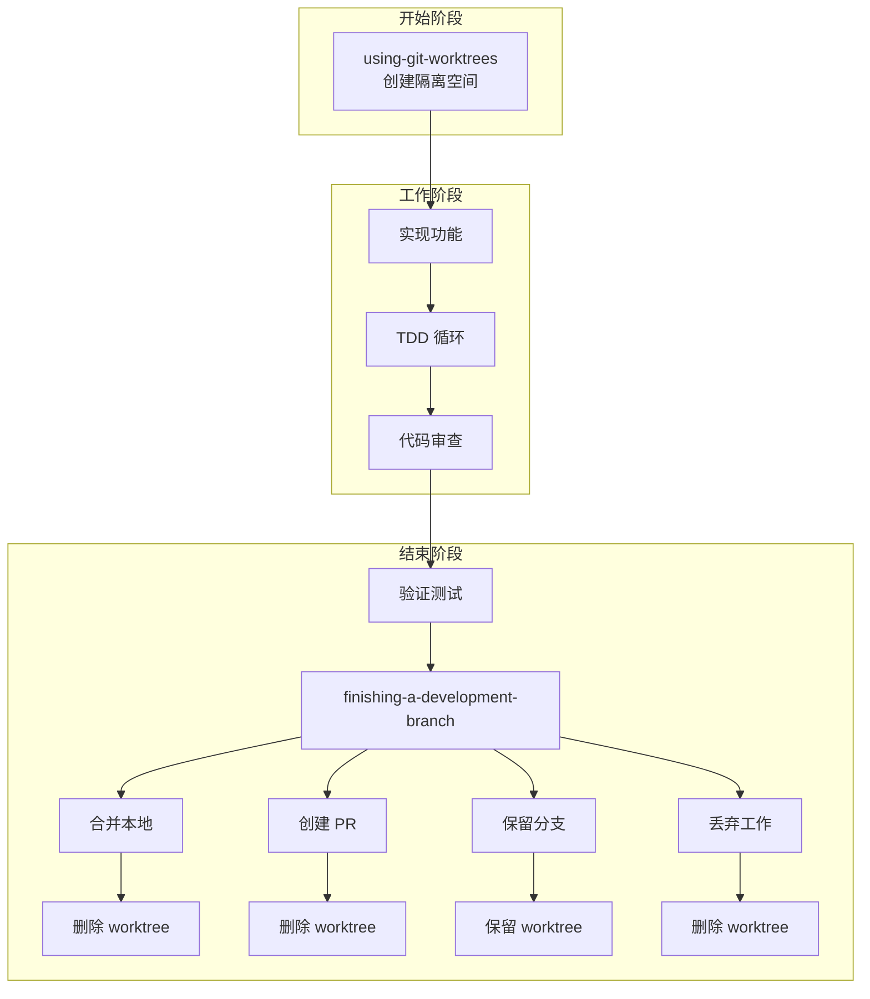

# Git Worktree 与 using-git-worktrees 技能详解

## 目录

- [什么是 Git Worktree](#什么是-git-worktree)
- [Git Worktree 核心命令](#git-worktree-核心命令)
- [using-git-worktrees 技能详解](#using-git-worktrees-技能详解)
- [完整流程图](#完整流程图)
- [目录选择优先级](#目录选择优先级)
- [安全验证机制](#安全验证机制)
- [完整示例](#完整示例)
- [红旗信号](#红旗信号)
- [与 finishing-a-development-branch 配合](#与-finishing-a-development-branch-配合)
- [常见问题](#常见问题)

---

## 什么是 Git Worktree

Git worktree 允许**同一个仓库**同时有**多个工作目录**，每个目录可以 checkout 不同的分支。

### 传统方式 vs Worktree 方式



### 核心优势

| 特性 | 传统方式 | Worktree 方式 |
|------|---------|--------------|
| 分支切换 | 需要 stash 或丢弃更改 | 无需切换，并行工作 |
| 目录数量 | 1 个 | 多个（按需创建） |
| 冲突风险 | 高（同一目录操作） | 低（物理隔离） |
| IDE 支持 | 需关闭重开 | 可同时打开多个窗口 |
| 存储效率 | 每次克隆完整仓库 | 共享 .git，节省空间 |

### 实际应用场景

```
场景 1: 开发者 + AI 并行工作
├── ~/project/              → 开发者继续开发 main 分支
├── ~/.worktrees/ai-task/   → AI 在独立目录实现新功能
└── 无冲突，各自工作

场景 2: 多功能并行开发
├── ~/project/              → 主分支维护
├── ~/.worktrees/auth/      → 开发认证功能
├── ~/.worktrees/api/       → 开发 API 功能
└── 多个功能同时开发

场景 3: 紧急 Hotfix
├── ~/project/              → 继续功能开发（不打断）
├── ~/.worktrees/hotfix/    → 修复紧急 bug
└── 功能开发不被打断
```

---

## Git Worktree 核心命令

### 基础命令一览

| 命令 | 用途 | 示例 |
|------|------|------|
| `git worktree add` | 创建新 worktree | `git worktree add .wt/auth -b feature/auth` |
| `git worktree list` | 列出所有 worktree | `git worktree list` |
| `git worktree remove` | 删除 worktree | `git worktree remove .wt/auth` |
| `git worktree prune` | 清理残留记录 | `git worktree prune` |
| `git worktree lock` | 锁定（防 prune） | `git worktree lock .wt/auth` |
| `git worktree unlock` | 解锁 | `git worktree unlock .wt/auth` |

### 创建 Worktree

```bash
# 创建新 worktree 并新建分支（最常用）
git worktree add <path> -b <new-branch>

# 示例
git worktree add .worktrees/auth -b feature/auth

# 输出：
# Creating worktree at '.worktrees/auth'
# Creating new branch 'feature/auth'
# HEAD is now at abc1234...

# 基于已有分支创建 worktree
git worktree add <path> <existing-branch>

# 示例
git worktree add .worktrees/hotfix hotfix/bug-123

# 从特定 commit 创建 worktree
git worktree add <path> <commit> -b <new-branch>

# 示例
git worktree add .worktrees/experiment abc1234 -b experiment
```

### 列出 Worktree

```bash
git worktree list

# 输出示例：
# /home/user/project           abc1234 [main]
# /home/user/project/.wt/auth  def5678 [feature/auth]
# /home/user/project/.wt/api   ghi9012 [feature/api]

# 详细信息模式
git worktree list --porcelain

# 输出：
# worktree /home/user/project
# HEAD abc1234def5678...
# branch refs/heads/main
# 
# worktree /home/user/project/.wt/auth
# HEAD def5678ghi9012...
# branch refs/heads/feature/auth
```

### 删除 Worktree

```bash
# 正常删除（干净状态）
git worktree remove <path>

# 示例
git worktree remove .worktrees/auth

# 强制删除（有未提交更改）
git worktree remove --force <path>

# 示例
git worktree remove --force .worktrees/auth

# 注意：删除前确保工作已合并或不需要
```

### 清理残留记录

```bash
# 当 worktree 目录被手动删除后，清理 Git 记录
git worktree prune

# 查看将被清理的内容（不实际执行）
git worktree prune --dry-run

# 详细输出
git worktree prune -v
```

### 锁定/解锁 Worktree

```bash
# 锁定（防止被 prune 清理）
git worktree lock <path>

# 示例（长时间不用的 worktree）
git worktree lock .worktrees/long-term-feature

# 带原因锁定
git worktree lock .worktrees/research --reason "实验性功能，保留参考"

# 解锁
git worktree unlock <path>

# 示例
git worktree unlock .worktrees/research
```

### 在 Worktree 中工作

```bash
# 进入 worktree 目录
cd .worktrees/auth

# 此时所有 git 命令正常工作
git status
git add .
git commit -m "feat: add auth"
git push origin feature/auth

# 返回主工作目录
cd ../..
```

---

## using-git-worktrees 技能详解

### 技能触发时机



**强制调用规则：**
- 在 `main`/`master` 分支直接实现是**禁止的**
- 必须创建独立 worktree 后才能开始编码
- 这是 Superpowers 的硬性规定

### 技能完整流程



---

## 完整流程图

### 目录选择决策流程



### 安全验证流程



### 项目设置流程



### 基线验证流程



---

## 目录选择优先级

### 优先级规则

```
优先级 1: 已存在目录（最高）
├── .worktrees 存在 → 使用 .worktrees
├── worktrees 存在 → 使用 worktrees
└── 两者都存在 → 使用 .worktrees（隐藏目录优先）

优先级 2: CLAUDE.md 配置
├── grep -i "worktree.*director" CLAUDE.md
└── 找到配置 → 使用配置路径

优先级 3: 询问用户（最低）
├── 选项 1: .worktrees/ (项目本地，隐藏)
└── 选项 2: ~/.config/superpowers/worktrees/<project>/ (全局)
```

### 为什么 .worktrees 优先？

| 考虑因素 | .worktrees (隐藏) | worktrees (非隐藏) |
|---------|------------------|-------------------|
| 可见性 | 不干扰 ls 输出 | 可能干扰 |
| 约定 | 更常见 | 较少见 |
| IDE | 大多数 IDE 隐藏 | 可能显示 |
| 误操作 | 降低误删风险 | 较高风险 |

### 两种位置类型对比

| 特性 | 项目本地 (.worktrees/) | 全局 (~/.config/superpowers/worktrees/) |
|------|----------------------|----------------------------------------|
| .gitignore 验证 | **必须** | 不需要 |
| 位置 | 项目目录内 | 项目目录外 |
| 可移植性 | 随项目移动 | 固定位置 |
| 清理便利性 | 随项目删除 | 需单独管理 |
| 多项目冲突 | 无 | 需按项目名区分 |

---

## 安全验证机制

### 为什么必须验证 .gitignore？

**问题场景演示：**

```bash
# 假设 .worktrees 未被忽略
git status

# 错误输出：
On branch main
Untracked files:
  (use "git add <file>..." to include in what will be committed)
    .worktrees/
    .worktrees/auth/
    .worktrees/auth/src/
    .worktrees/auth/src/index.ts
    .worktrees/auth/package.json
    .worktrees/auth/node_modules/
    ... (成百上千文件)
```

**后果：**
- `git status` 输出混乱
- 可能误提交 worktree 内容
- `.gitignore` 污染

### 验证方法

```bash
# 检查目录是否被忽略
git check-ignore -q .worktrees

# 返回值含义：
# 0 → 已被忽略（安全）
# 1 → 未被忽略（需要修复）

# 详细验证（显示匹配规则）
git check-ignore -v .worktrees
# 输出：.gitignore:1:.worktrees    .worktrees
```

### 自动修复流程

```bash
# 1. 添加到 .gitignore
echo ".worktrees/" >> .gitignore

# 或更完整的规则
echo "# Worktrees directory
.worktrees/
worktrees/" >> .gitignore

# 2. 提交更改
git add .gitignore
git commit -m "chore: ignore worktrees directory"

# 3. 验证修复
git check-ignore -q .worktrees  # 应返回 0
```

---

## 完整示例

### 示例 1: Node.js 项目

```bash
# === 声明 ===
"I'm using the using-git-worktrees skill to set up an isolated workspace."

# === 阶段1: 目录选择 ===
ls -d .worktrees 2>/dev/null
# 输出：.worktrees（存在）

# === 阶段2: 安全验证 ===
git check-ignore -q .worktrees
# 返回：0（已忽略，安全）

# === 阶段3: 创建 Worktree ===
git worktree add .worktrees/auth -b feature/auth
# 输出：
# Creating worktree at '.worktrees/auth'
# Creating new branch 'feature/auth'
# HEAD is now at abc1234 Initial commit

cd .worktrees/auth

# === 阶段4: 项目设置 ===
ls package.json  # 存在
npm install
# 输出：
# added 150 packages in 5s

# === 阶段5: 基线验证 ===
npm test
# 输出：
# Test Suites: 5 passed, 5 total
# Tests:       47 passed, 47 total

# === 报告 ===
"Worktree ready at /Users/jesse/myproject/.worktrees/auth
Tests passing (47 tests, 0 failures)
Ready to implement auth feature"
```

### 示例 2: Rust 项目

```bash
# === 声明 ===
"I'm using the using-git-worktrees skill to set up an isolated workspace."

# === 目录不存在，询问用户 ===
"No worktree directory found. Where should I create worktrees?
1. .worktrees/ (project-local, hidden)
2. ~/.config/superpowers/worktrees/myproject/ (global location)

Which would you prefer?"

# 用户选择：1

# === 创建目录并添加到 .gitignore ===
mkdir -p .worktrees
echo ".worktrees/" >> .gitignore
git add .gitignore
git commit -m "chore: ignore worktrees directory"

# === 创建 Worktree ===
git worktree add .worktrees/api -b feature/api
cd .worktrees/api

# === Rust 项目设置 ===
ls Cargo.toml  # 存在
cargo build
# 输出：
# Compiling myproject v0.1.0
# Finished dev [unoptimized] target(s) in 10s

# === 基线验证 ===
cargo test
# 输出：
# running 10 tests
# test result: ok. 10 passed; 0 failed

# === 报告 ===
"Worktree ready at /Users/jesse/myproject/.worktrees/api
Tests passing (10 tests, 0 failures)
Ready to implement API feature"
```

### 示例 3: 全局位置

```bash
# === 用户选择全局位置 ===
# 选择：2 ~/.config/superpowers/worktrees/<project>/

# === 无需 .gitignore 验证（项目外） ===

# === 创建 Worktree ===
project=$(basename "$(git rev-parse --show-toplevel)")
# project = "myproject"

git worktree add ~/.config/superpowers/worktrees/myproject/hotfix -b hotfix/bug-123

cd ~/.config/superpowers/worktrees/myproject/hotfix

# === Python 项目设置 ===
ls requirements.txt  # 存在
pip install -r requirements.txt

# === 基线验证 ===
pytest
# 输出：
# 8 passed in 2.5s

# === 报告 ===
"Worktree ready at ~/.config/superpowers/worktrees/myproject/hotfix
Tests passing (8 tests, 0 failures)
Ready to fix bug-123"
```

---

## 红旗信号

### 绝对禁止的行为



### 红旗信号详解

| 红旗 | 问题 | 正确做法 |
|------|------|---------|
| **在 main/master 直接实现** | 与开发者冲突风险高 | 必须创建 worktree |
| **不验证 .gitignore** | worktree 内容污染 git status | 运行 `git check-ignore` |
| **跳过基线测试** | 无法区分新旧 bug | 运行测试并记录结果 |
| **猜测目录位置** | 违反项目约定 | 检查现有目录 → CLAUDE.md → 询问 |
| **不检查 CLAUDE.md** | 忽略项目配置 | grep 配置优先 |
| **测试失败继续** | 基线已损坏 | 询问用户是否继续 |
| **硬编码设置命令** | 项目工具不一致 | 自动检测项目类型 |

### 正确做法清单

```
✅ 声明使用技能
✅ 检查现有目录（.worktrees > worktrees）
✅ 检查 CLAUDE.md 配置
✅ 询问用户（如果无配置）
✅ 验证 .gitignore（项目本地目录）
✅ 自动修复（如果未忽略）
✅ 创建 worktree + 新分支
✅ 进入 worktree 目录
✅ 检测项目类型
✅ 运行依赖安装
✅ 运行基线测试
✅ 报告结果
```

---

## 与 finishing-a-development-branch 配合

### 完整生命周期



### 各选项的 Worktree 处理

| 选项 | 分支处理 | Worktree 处理 |
|------|---------|--------------|
| **合并本地** | 合并后删除分支 | **删除 worktree** |
| **创建 PR** | 推送分支 | **删除 worktree** |
| **保留分支** | 保留分支 | **保留 worktree** |
| **丢弃工作** | 强制删除分支 | **删除 worktree** |

### 清理命令

```bash
# 正常清理
git worktree remove .worktrees/auth

# 强制清理（有未提交更改）
git worktree remove --force .worktrees/auth

# 回到主工作目录
cd /path/to/main/project

# 查看剩余 worktree
git worktree list
```

### 保留分支时的工作流

```bash
# 选择"保留分支"
"Keeping branch feature/auth. Worktree preserved at .worktrees/auth."

# 后续继续工作
cd .worktrees/auth
git status
# 继续开发...

# 最终清理
git worktree remove .worktrees/auth
```

---

## 常见问题

### Q1: Worktree 和 clone 有什么区别？

| 特性 | Worktree | Clone |
|------|---------|-------|
| 存储共享 | 共享 .git | 完整复制 |
| 空间占用 | 小 | 大（完整仓库） |
| 创建速度 | 快 | 慢（需要下载） |
| 网络需求 | 无 | 需要网络 |
| 分支同步 | 实时同步 | 需 fetch/push |

### Q2: 可以在 Worktree 中创建新的 Worktree 吗？

```bash
# 可以，但不推荐
cd .worktrees/auth
git worktree add ../api -b feature/api

# 推荐做法：回到主目录创建
cd /path/to/main/project
git worktree add .worktrees/api -b feature/api
```

### Q3: Worktree 目录可以放在任意位置吗？

```bash
# 可以，但建议遵循约定
git worktree add /tmp/temp-work -b temp

# 问题：
# - 不易管理
# - 可能遗忘位置
# - 清理困难

# 推荐位置：
# - 项目内：.worktrees/ 或 worktrees/
# - 全局：~/.config/superpowers/worktrees/<project>/
```

### Q4: 如何处理 Worktree 中的冲突？

```bash
# Worktree 本身不会产生冲突
# 冲突发生在合并时

# 在 worktree 中完成工作
cd .worktrees/auth
git add .
git commit -m "feat: auth complete"

# 推送
git push origin feature/auth

# 回到主目录合并
cd /path/to/main/project
git merge feature/auth

# 如果有冲突，正常解决
# Git 会标记冲突文件
```

### Q5: 多个 Worktree 如何管理？

```bash
# 查看所有 worktree
git worktree list

# 输出：
# /home/user/project           main
# /home/user/project/.wt/auth  feature/auth
# /home/user/project/.wt/api   feature/api

# 同时打开多个 IDE 窗口
# VSCode: code .worktrees/auth
# 另一个窗口: code .worktrees/api

# 批量清理
git worktree list | grep ".wt" | while read wt; do
  git worktree remove $(echo $wt | awk '{print $1}')
done
```

### Q6: Worktree 删除后分支还在吗？

```bash
# 删除 worktree 不影响分支
git worktree remove .worktrees/auth

# 分支仍然存在
git branch
# * main
#   feature/auth  ← 仍然存在

# 需要单独删除分支
git branch -d feature/auth  # 合并后可删除
git branch -D feature/auth  # 强制删除
```

### Q7: 误删 Worktree 目录怎么办？

```bash
# 手动删除目录（错误方式）
rm -rf .worktrees/auth

# Git 记录残留
git worktree list
# /home/user/project/.wt/auth  (残留记录)

# 清理残留记录
git worktree prune

# 或重新创建
git worktree add .worktrees/auth feature/auth
```

---

## 总结

### 核心要点

| 要点 | 说明 |
|------|------|
| **隔离原则** | AI 不在开发者当前目录工作 |
| **强制触发** | 实现前必须创建 worktree |
| **安全验证** | .gitignore 必须忽略 worktree 目录 |
| **基线验证** | 测试必须通过才能开始 |
| **约定优先** | .worktrees > worktrees > CLAUDE.md > 询问 |

### 快速参考

```bash
# 创建
git worktree add .worktrees/<name> -b <branch>

# 进入
cd .worktrees/<name>

# 查看
git worktree list

# 删除
git worktree remove .worktrees/<name>

# 清理残留
git worktree prune
```

### 技能调用关系

```
brainstorming (设计批准)
    ↓
using-git-worktrees (必须)
    ↓
writing-plans
    ↓
subagent-driven-development / executing-plans
    ↓
finishing-a-development-branch
    ↓
worktree 清理
```