# Superpowers 流程图详解

## 目录大纲

- [1. Superpowers 整体架构](#1-superpowers-整体架构) - 核心层、技能库、平台适配层架构
- [2. 主开发工作流](#2-主开发工作流) - 从用户发起任务到完成的完整流程
- [3. 技能调用流程](#3-技能调用流程) - 技能判断与调用的决策流程
- [4. Brainstorming 技能流程](#4-brainstorming-技能流程) - 苏格拉底式设计精炼流程
- [5. Git Worktrees 技能流程](#5-git-worktrees-技能流程) - 隔离工作空间设置
- [6. Writing Plans 技能流程](#6-writing-plans-技能流程) - 详细实现计划编写
- [7. Subagent-driven Development 技能流程](#7-subagent-driven-development-技能流程) - 两级审查执行流程
- [8. TDD 循环](#8-tdd-test-driven-development-循环) - RED-GREEN-REFACTOR 核心循环
- [9. TDD 验证流程详情](#9-tdd-验证流程详情) - TDD 详细验证步骤
- [10. Systematic Debugging 四阶段流程](#10-systematic-debugging-四阶段流程) - 根因调查、模式分析、假设测试、实现
- [11. Verification Before Completion 流程](#11-verification-before-completion-流程) - 声明前必须有证据
- [12. Code Review 流程](#12-code-review-流程) - 请求审查与接收审查
- [13. Finishing Development Branch 流程](#13-finishing-development-branch-流程) - 合并/PR/保留/丢弃选项
- [14. Writing Skills 流程](#14-writing-skills-流程) - RED-GREEN-REFACTOR 创建技能
- [15. Dispatching Parallel Agents 流程](#15-dispatching-parallel-agents-流程) - 并行分派独立任务
- [16. 技能类型分类](#16-技能类型分类) - 测试类、调试类、协作类、元类
- [17. 平台适配映射](#17-平台适配映射) - Claude Code、OpenCode、Copilot、Gemini 工具映射
- [18. 用户指令优先级](#18-用户指令优先级) - 用户指令 > 技能 > 默认提示
- [19. 技能执行中的红旗信号](#19-技能执行中的红旗信号) - using-superpowers、TDD、调试、验证红旗
- [20. 完整会话生命周期](#20-完整会话生命周期) - 从会话开始到结束的全流程
- [关键概念总结](#关键概念总结) - 各核心组件用途对照表

---

## 1. Superpowers 整体架构

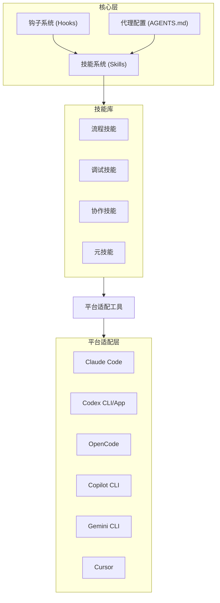

## 2. 主开发工作流

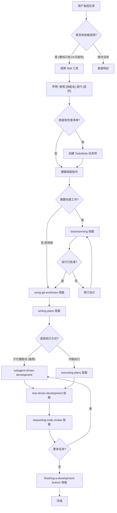

## 3. 技能调用流程

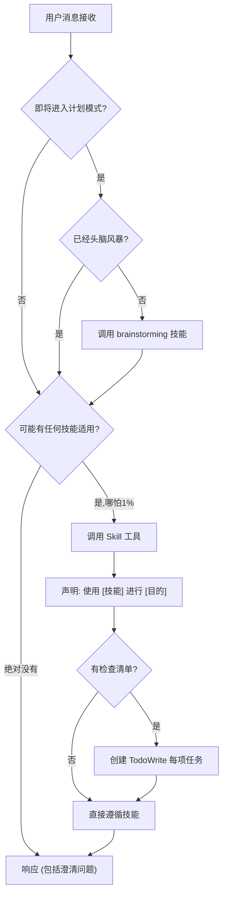

## 4. Brainstorming 技能流程

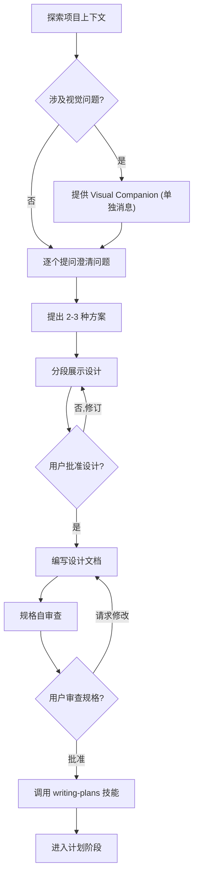

## 5. Git Worktrees 技能流程

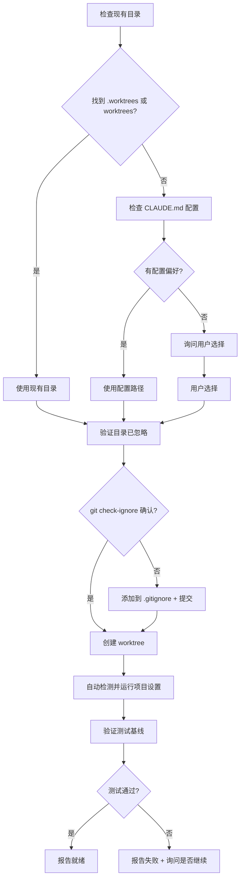

## 6. Writing Plans 技能流程

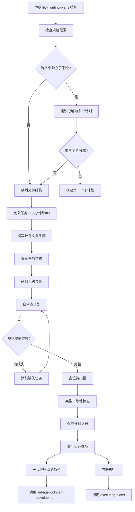

## 7. Subagent-driven Development 技能流程

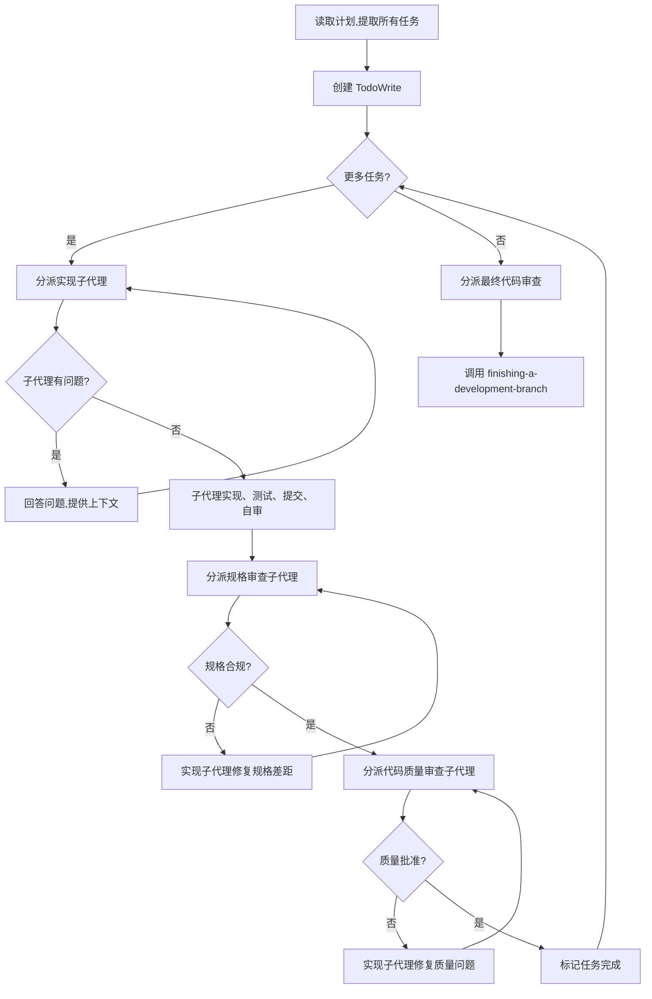

## 8. TDD (Test-Driven Development) 循环

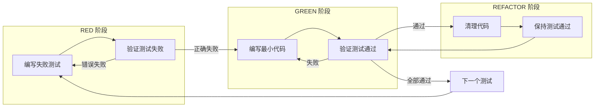

## 9. TDD 验证流程详情

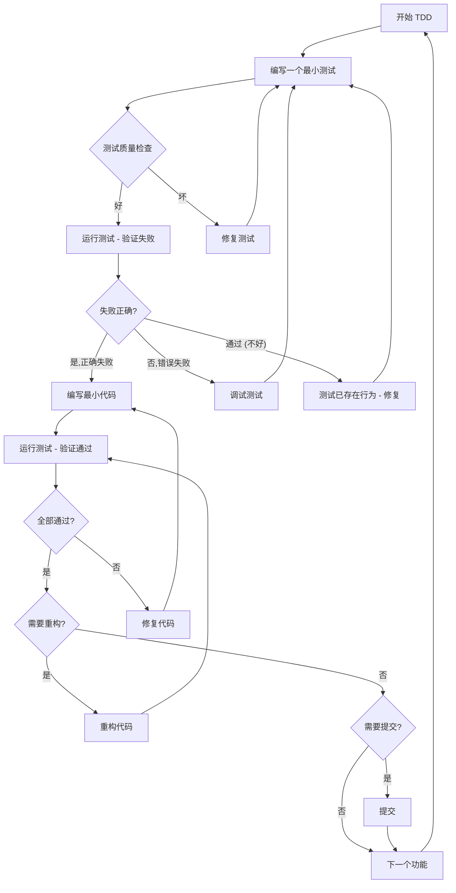

## 10. Systematic Debugging 四阶段流程

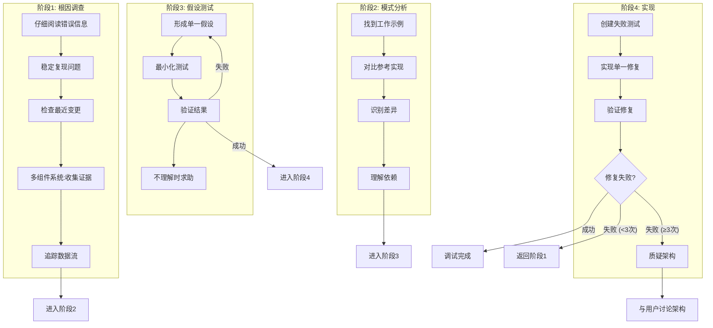

## 11. Verification Before Completion 流程

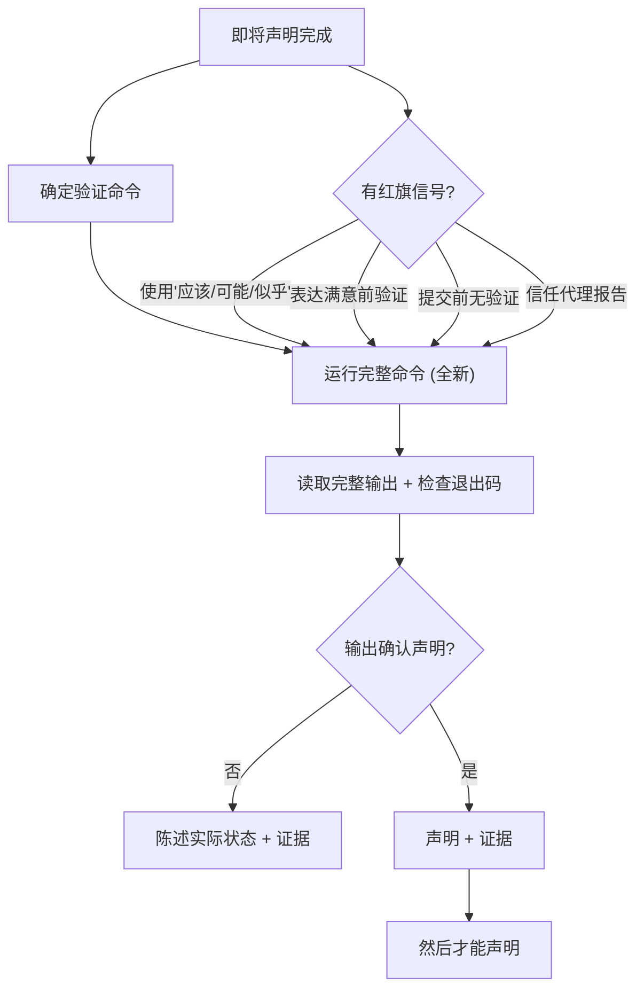

## 12. Code Review 流程

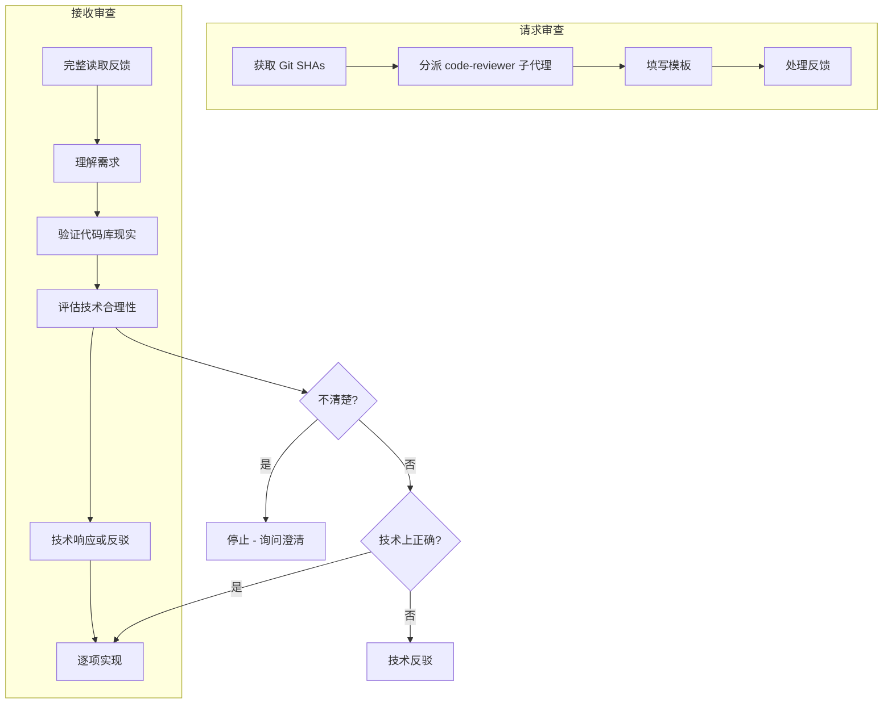

## 13. Finishing Development Branch 流程

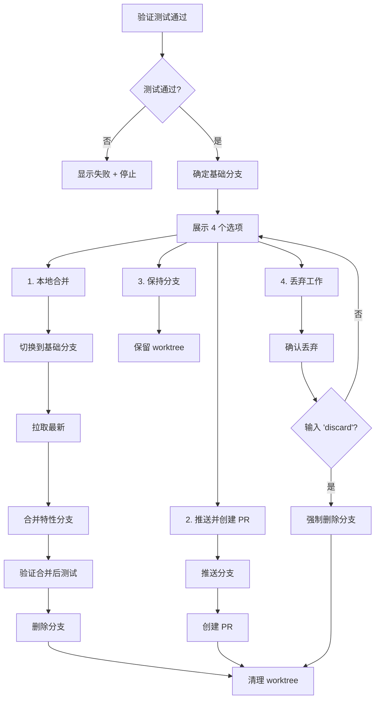

## 14. Writing Skills 流程

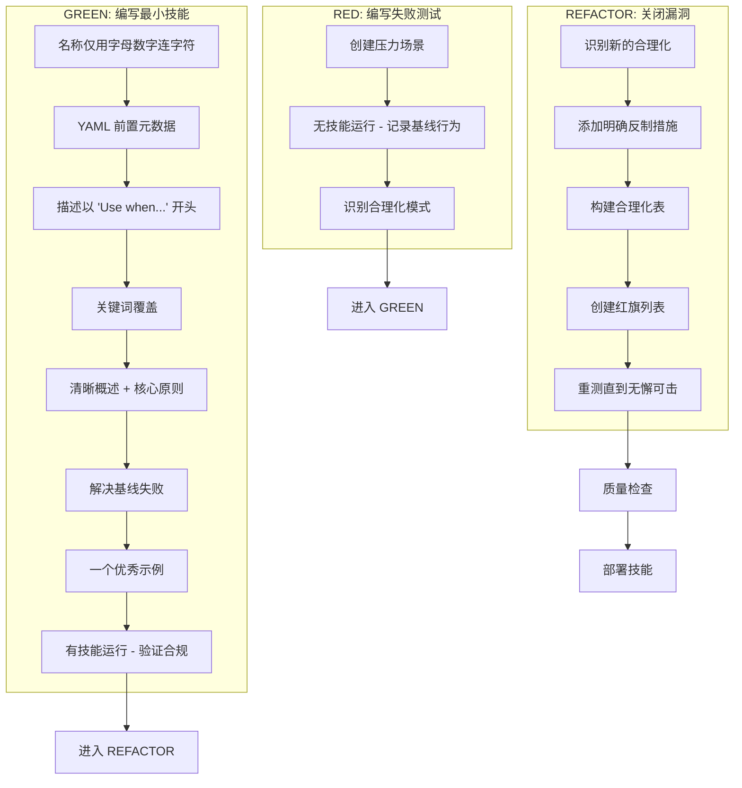

## 15. Dispatching Parallel Agents 流程

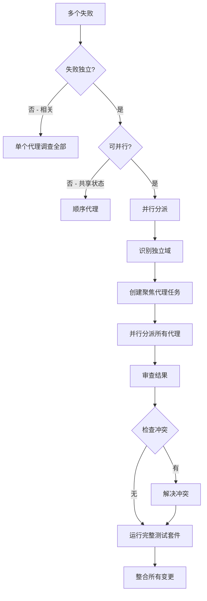

## 16. 技能类型分类

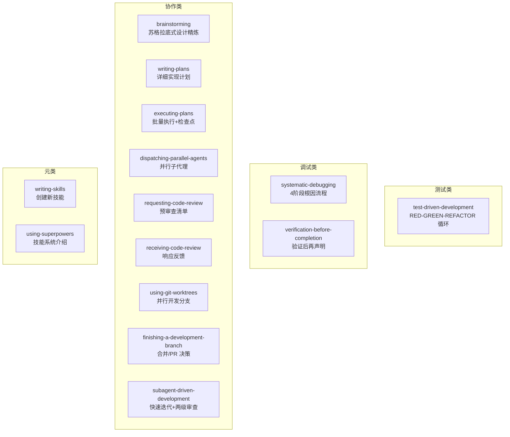

## 17. 平台适配映射

```mermaid
graph TB
    subgraph Tools["工具映射"]
        TodoWrite["TodoWrite"]
        Task["Task 子代理"]
        Skill["Skill 工具"]
        Read["Read"]
        Write["Write"]
        Edit["Edit"]
        Bash["Bash"]
    end
    
    subgraph ClaudeCode["Claude Code"]
        CC_TodoWrite["TodoWrite (原生)"]
        CC_Task["Task 工具"]
        CC_Skill["Skill 工具"]
        CC_Read["Read 工具"]
        CC_Write["Write 工具"]
        CC_Edit["Edit 工具"]
        CC_Bash["Bash 工具"]
    end
    
    subgraph OpenCode["OpenCode"]
        OC_TodoWrite["todowrite (原生)"]
        OC_Task["@mention 子代理"]
        OC_Skill["skill 工具"]
        OC_Native["原生工具"]
    end
    
    subgraph Copilot["Copilot CLI"]
        CP_TodoWrite["skill 工具"]
        CP_Task["skill 工具"]
        CP_Skill["skill 工具"]
    end
    
    subgraph Gemini["Gemini CLI"]
        GM_TodoWrite["activate_skill"]
        GM_Task["activate_skill"]
        GM_Skill["activate_skill"]
    end
    
    TodoWrite --> CC_TodoWrite
    TodoWrite --> OC_TodoWrite
    TodoWrite --> CP_TodoWrite
    TodoWrite --> GM_TodoWrite
    
    Task --> CC_Task
    Task --> OC_Task
    Task --> CP_Task
    Task --> GM_Task
    
    Skill --> CC_Skill
    Skill --> OC_Skill
    Skill --> CP_Skill
    Skill --> GM_Skill
```

## 18. 用户指令优先级

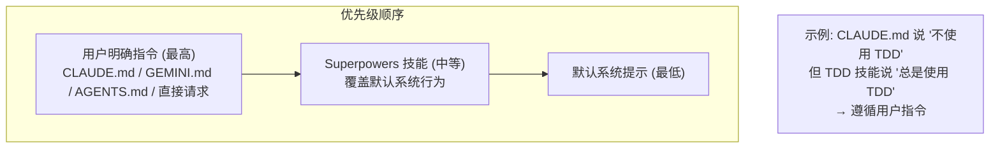

## 19. 技能执行中的红旗信号

```mermaid
graph TB
    subgraph UsingSuperpowers["using-superpowers 红旗"]
        US1["'这只是简单问题'"]
        US2["'需要更多上下文'"]
        US3["'先探索代码库'"]
        US4["'不需要正式技能'"]
        US5["'我记得这个技能'"]
        US6["'技能太过度了'"]
    end
    
    subgraph TDD["TDD 红旗"]
        TDD1["代码先于测试"]
        TDD2["测试立即通过"]
        TDD3["'简单到不需要测试'"]
        TDD4["'事后测试也一样'"]
        TDD5["'保留作为参考'"]
        TDD6["'只是这一次'"]
    end
    
    subgraph Debugging["调试红旗"]
        DBG1["'快速修复,稍后调查'"]
        DBG2["'试试改变 X'"]
        DBG3["'多个修改一起'"]
        DBG4["'假设是 X,先修复'"]
        DBG5["'3+ 次修复后继续'"]
    end
    
    subgraph Verification["验证红旗"]
        VER1["使用 '应该/可能/似乎'"]
        VER2["验证前表达满意"]
        VER3["信任代理成功报告"]
        VER4["依赖部分验证"]
    end
    
    US1 --> STOP_US["停止 → 调用技能"]
    US2 --> STOP_US
    US3 --> STOP_US
    US4 --> STOP_US
    US5 --> STOP_US
    US6 --> STOP_US
    
    TDD1 --> STOP_TDD["停止 → 删除代码,重新开始"]
    TDD2 --> STOP_TDD
    TDD3 --> STOP_TDD
    TDD4 --> STOP_TDD
    TDD5 --> STOP_TDD
    TDD6 --> STOP_TDD
    
    DBG1 --> STOP_DBG["停止 → 返回阶段1"]
    DBG2 --> STOP_DBG
    DBG3 --> STOP_DBG
    DBG4 --> STOP_DBG
    DBG5 --> QuestionArch["质疑架构"]
    
    VER1 --> STOP_VER["停止 → 运行验证"]
    VER2 --> STOP_VER
    VER3 --> STOP_VER
    VER4 --> STOP_VER
```

## 20. 完整会话生命周期

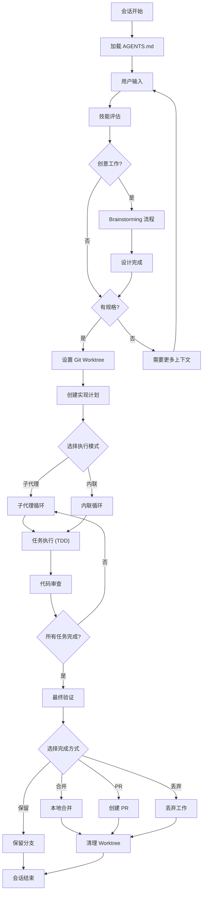

---

## 关键概念总结

| 组件 | 用途 |
|------|------|
| **using-superpowers** | 入口点 - 判断是否有/哪些技能适用 |
| **brainstorming** | 通过对话精炼设计 |
| **using-git-worktrees** | 设置隔离工作空间 |
| **writing-plans** | 详细实现计划编写 |
| **subagent-driven-development** | 用全新子代理执行计划 |
| **test-driven-development** | RED-GREEN-REFACTOR 循环 |
| **systematic-debugging** | 4阶段根因调查流程 |
| **verification-before-completion** | 声明前必须有证据 |
| **requesting-code-review** | 提交前审查流程 |
| **finishing-a-development-branch** | 合并/PR/清理工作流 |
| **writing-skills** | TDD方法创建文档技能 |