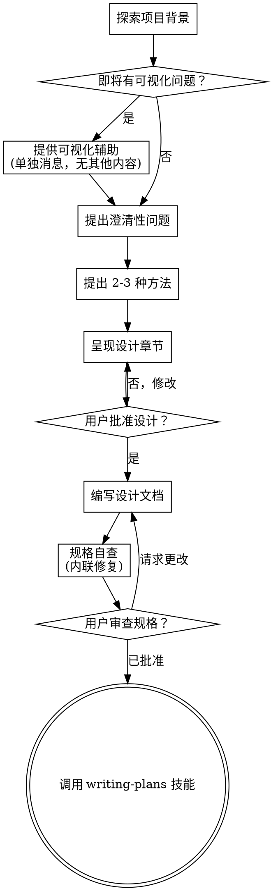

# 将想法头脑风暴成设计

通过自然的协作对话，帮助将想法转化为完整的设计和规格。

首先了解当前项目背景，然后逐个提问来细化想法。一旦理解了要构建的内容，呈现设计并获得用户批准。

<HARD-GATE>
在你呈现设计并获得用户批准之前，不要调用任何实现技能、编写任何代码、搭建任何项目或采取任何实现行动。这适用于每个项目，无论看似多简单。
</HARD-GATE>

## 反模式："这太简单了不需要设计"

每个项目都要经历这个流程。待办清单、单一功能工具、配置更改 — 所有这些。"简单"项目正是未审视的假设造成最多浪费工作的地方。设计可以很短（对于真正简单的项目只需几句话），但你必须呈现它并获得批准。

## 检查清单

你必须为以下每项创建任务并按顺序完成：

1. **探索项目背景** — 检查文件、文档、最近提交
2. **提供可视化辅助**（如果主题涉及可视化问题）— 这是单独的消息，不与澄清性问题合并。见下方可视化辅助章节。
3. **提出澄清性问题** — 一次一个，理解目的/约束/成功标准
4. **提出 2-3 种方法** — 带权衡和你的建议
5. **呈现设计** — 按复杂度缩放的章节，每节后获得用户批准
6. **编写设计文档** — 保存到 `docs/superpowers/specs/YYYY-MM-DD-<topic>-design.md` 并提交
7. **规格自查** — 快速内联检查占位符、矛盾、歧义、范围（见下方）
8. **用户审查书面规格** — 请用户在继续之前审查规格文件
9. **过渡到实现** — 调用 writing-plans 技能创建实现计划

## 流程图

**终止状态是调用 writing-plans。** 不要调用 frontend-design、mcp-builder 或任何其他实现技能。头脑风暴后你调用的唯一技能是 writing-plans。

## 流程

**理解想法：**

- 首先检查当前项目状态（文件、文档、最近提交）
- 在提出详细问题之前，评估范围：如果请求描述多个独立子系统（例如，"构建一个包含聊天、文件存储、计费和分析的平台"），立即标记。不要花时间细化一个需要先分解的项目细节。
- 如果项目太大无法放入单个规格，帮助用户分解为子项目：独立的部分有哪些、它们如何关联、应该按什么顺序构建？然后通过正常设计流程头脑风暴第一个子项目。每个子项目都有自己的规格 → 计划 → 实现循环。
- 对于范围适当的项目，一次一个问题细化想法
- 尽可能使用多选题，但开放式也可以
- 每条消息只有一个问题 — 如果主题需要更多探索，拆分为多个问题
- 关注理解：目的、约束、成功标准

**探索方法：**

- 提出 2-3 种不同方法及权衡
- 用对话方式呈现选项，附上你的建议和理由
- 以你推荐的选项开头并解释原因

**呈现设计：**

- 一旦你认为理解了要构建的内容，呈现设计
- 每节按复杂度缩放：如果简单就几句话，如果微妙最多 200-300 字
- 每节后询问目前看起来是否正确
- 覆盖：架构、组件、数据流、错误处理、测试
- 准备好返回澄清如果某些内容说不通

**为隔离和清晰设计：**

- 将系统分解为更小的单元，每个单元有单一清晰目的、通过定义良好的接口通信、可以独立理解和测试
- 对于每个单元，你应该能回答：它做什么、如何使用它、它依赖什么？
- 有人能不读内部实现就理解单元做什么吗？你能改变内部实现而不破坏使用者吗？如果不能，边界需要调整。
- 更小、边界良好的单元也更容易让你处理 — 你能更好地推理可以一次放入上下文的代码，当文件聚焦时你的编辑更可靠。当文件变大时，这通常是它做了太多的信号。

**在现有代码库中工作：**

- 在提出更改之前探索当前结构。遵循现有模式。
- 当现有代码有问题影响工作（例如，文件太大、边界不清、职责纠缠），将针对性改进作为设计的一部分 — 就像优秀开发者在他们工作的代码中所做的那样。
- 不要提出无关的重构。保持关注服务当前目标的内容。

## 设计之后

**文档：**

- 将验证过的设计（规格）写入 `docs/superpowers/specs/YYYY-MM-DD-<topic>-design.md`
  - （用户对规格位置的偏好覆盖此默认值）
- 如果有 elements-of-style:writing-clearly-and-concisely 技能则使用
- 将设计文档提交到 git

**规格自查：**
编写规格文档后，用新眼光审视：

1. **占位符扫描：** 有任何 "TBD"、"TODO"、不完整章节或模糊需求吗？修复它们。
2. **内部一致性：** 任何章节相互矛盾吗？架构与功能描述匹配吗？
3. **范围检查：** 这足够聚焦于单一实现计划吗，还是需要分解？
4. **歧义检查：** 任何需求可以用两种不同方式解释吗？如果是，选一种并明确。

内联修复任何问题。不需要重新审查 — 只需修复并继续。

**用户审查关卡：**
规格审查循环通过后，请用户在继续之前审查书面规格：

> "规格已写入并提交到 `<path>`。请审查并在我们开始编写实现计划之前告诉我是否需要进行任何更改。"

等待用户回复。如果他们请求更改，进行更改并重新运行规格审查循环。只有在用户批准后才继续。

**实现：**

- 调用 writing-plans 技能创建详细实现计划
- 不要调用任何其他技能。writing-plans 是下一步。

## 核心原则

- **一次一个问题** — 不要用多个问题淹没用户
- **优先多选题** — 比开放式更容易回答
- **无情应用 YAGNI** — 从所有设计中移除不必要的功能
- **探索替代方案** — 在确定之前总是提出 2-3 种方法
- **增量验证** — 呈现设计，在继续之前获得批准
- **保持灵活** — 当某些内容说不通时返回澄清

## 可视化辅助

基于浏览器的辅助工具，用于在头脑风暴期间展示模型、图表和可视化选项。作为工具可用 — 不是模式。接受辅助意味着它可用于受益于可视化处理的问题；并不意味着每个问题都通过浏览器。

**提供辅助：** 当你预期即将到来的问题会涉及可视化内容（模型、布局、图表）时，一次性提供以获取同意：
> "我们正在处理的一些内容如果能在我向你展示的网页浏览器中展示可能会更容易解释。我可以在进行过程中整理模型、图表、比较和其他可视化内容。此功能仍然较新且可能消耗较多 token。想试试吗？（需要打开本地 URL）"

**此提供必须是单独的消息。** 不要将其与澄清性问题、背景摘要或任何其他内容结合。消息应只包含上面的提供内容，没有其他内容。在继续之前等待用户回复。如果他们拒绝，继续纯文本头脑风暴。

**按问题决定：** 即使在用户接受后，也要为每个问题单独决定是否使用浏览器或终端。判断标准：**用户通过观看是否比阅读更容易理解？**

- **使用浏览器**当内容本身就是可视化的 — 模型、线框图、布局比较、架构图、并排视觉设计
- **使用终端**当内容是文本 — 需求问题、概念选择、权衡列表、A/B/C/D 文本选项、范围决策

关于 UI 主题的问题不一定是可视化问题。"在这个上下文中个性意味着什么？"是概念性问题 — 使用终端。"哪种向导布局更好？"是可视化问题 — 使用浏览器。

如果他们同意使用辅助，在继续之前阅读详细指南：
`skills/brainstorming/visual-companion.md`