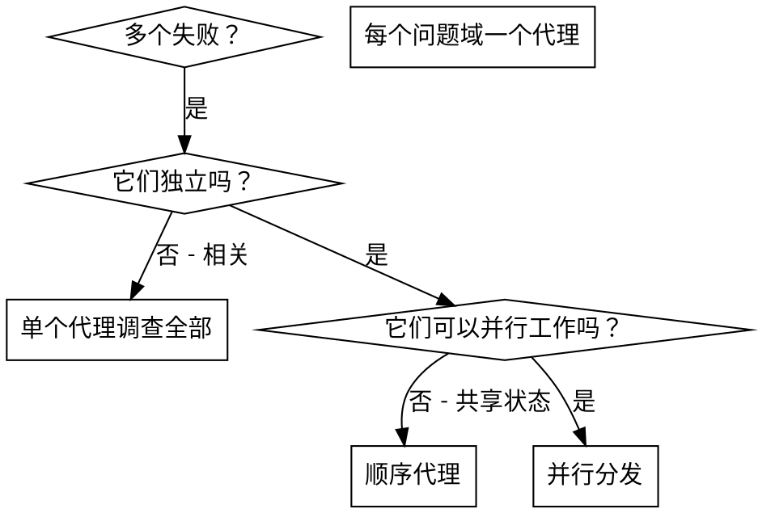

# 分发并行代理

## 概述

你将任务委托给具有隔离上下文的专门代理。通过精确构建他们的指令和上下文，确保他们保持专注并成功完成任务。他们不应继承你会话的上下文或历史——你构建他们所需的确切内容。这也为你自己的上下文保留空间用于协调工作。

当你有多个无关失败（不同测试文件、不同子系统、不同 bug），顺序调查浪费时间。每个调查是独立的，可以并行进行。

**核心原则：每个独立问题域分发一个代理。让他们并发工作。**

## 适用时机



**适用于：**
- 3+ test files failing with different root causes
- Multiple subsystems broken independently
- Each problem can be understood without context from others
- No shared state between investigations

**不适用于：**
- Failures are related (fix one might fix others)
- Need to understand full system state
- Agents would interfere with each other

## 模式

### 1. 识别独立域

按损坏内容分组失败：
- File A tests: Tool approval flow
- File B tests: Batch completion behavior
- File C tests: Abort functionality

每个域是独立的 — 修复工具批准不影响 abort 测试。

### 2. 创建专注代理任务

每个代理获得：
- **Specific scope:** One test file or subsystem
- **Clear goal:** Make these tests pass
- **Constraints:** Don't change other code
- **Expected output:** Summary of what you found and fixed

### 3. 并行分发

```typescript
// In Claude Code / AI environment
Task("Fix agent-tool-abort.test.ts failures")
Task("Fix batch-completion-behavior.test.ts failures")
Task("Fix tool-approval-race-conditions.test.ts failures")
// All three run concurrently
```

### 4. 审查并集成

当代理返回时：
- Read each summary
- Verify fixes don't conflict
- Run full test suite
- Integrate all changes

## 代理提示结构

好的代理提示是：
1. **专注**— 一个清晰问题域
2. **自包含**— 理解问题所需的所有上下文
3. **输出具体**— 代理应返回什么？

```markdown
Fix the 3 failing tests in src/agents/agent-tool-abort.test.ts:

1. "should abort tool with partial output capture" - expects 'interrupted at' in message
2. "should handle mixed completed and aborted tools" - fast tool aborted instead of completed
3. "should properly track pendingToolCount" - expects 3 results but gets 0

这些是时序/竞态条件问题。你的任务：

1. 读取测试文件并理解每个测试验证的内容
2. 识别根本原因 — 时序问题还是真正的 bug？
3. 通过以下方式修复：
   - 将任意超时替换为基于事件的等待
   - 如果发现 abort 实现中的 bug 则修复
   - 如果测试了改变的行为则调整测试预期

不要只是增加超时 — 找到真正的问题。

返回：你发现的和你修复的内容摘要。
```

## 常见错误

**❌ 太宽泛：** "Fix all the tests" - agent gets lost
**✅ 具体：** "Fix agent-tool-abort.test.ts" - focused scope

**❌ 无上下文：** "Fix the race condition" - agent doesn't know where
**✅ 有上下文：** Paste the error messages and test names

**❌ 无约束：** Agent might refactor everything
**✅ 有约束：** "Do NOT change production code" or "Fix tests only"

**❌ 模糊输出：** "Fix it" - you don't know what changed
**✅ 具体输出：** "Return summary of root cause and changes"

## 何时不使用

**相关失败：** 修复一个可能修复其他 — 先一起调查
**需要完整上下文：** 理解需要查看整个系统
**探索性调试：** 你尚不知道什么损坏
**共享状态：** 代理会干扰（编辑相同文件，使用相同资源）

## 会话真实示例

**场景：** 大重构后 3 个文件中 6 个测试失败

**失败：**
- agent-tool-abort.test.ts: 3 failures (timing issues)
- batch-completion-behavior.test.ts: 2 failures (tools not executing)
- tool-approval-race-conditions.test.ts: 1 failure (execution count = 0)

**决策：** 独立域 — abort 逻辑与 batch completion 与 race conditions 分离

**分发：**
```
Agent 1 → Fix agent-tool-abort.test.ts
Agent 2 → Fix batch-completion-behavior.test.ts
Agent 3 → Fix tool-approval-race-conditions.test.ts
```

**结果：**
- Agent 1: Replaced timeouts with event-based waiting
- Agent 2: Fixed event structure bug (threadId in wrong place)
- Agent 3: Added wait for async tool execution to complete

**集成：** 所有修复独立，无冲突，完整套件绿色

**节省时间：** 3 个问题并行解决而非顺序

## 关键益处

1. **并行化**— 多个调查同时进行
2. **专注**— 每个代理有窄范围，更少上下文需跟踪
3. **独立性**— 代理不互相干扰
4. **速度**— 在 1 个问题时间内解决 3 个问题

## 验证

代理返回后：
1. **Review each summary** - Understand what changed
2. **Check for conflicts** - Did agents edit same code?
3. **Run full suite** - Verify all fixes work together
4. **Spot check** - Agents can make systematic errors

## 真实世界影响

From debugging session (2025-10-03):
- 6 failures across 3 files
- 3 agents dispatched in parallel
- All investigations completed concurrently
- All fixes integrated successfully
- Zero conflicts between agent changes