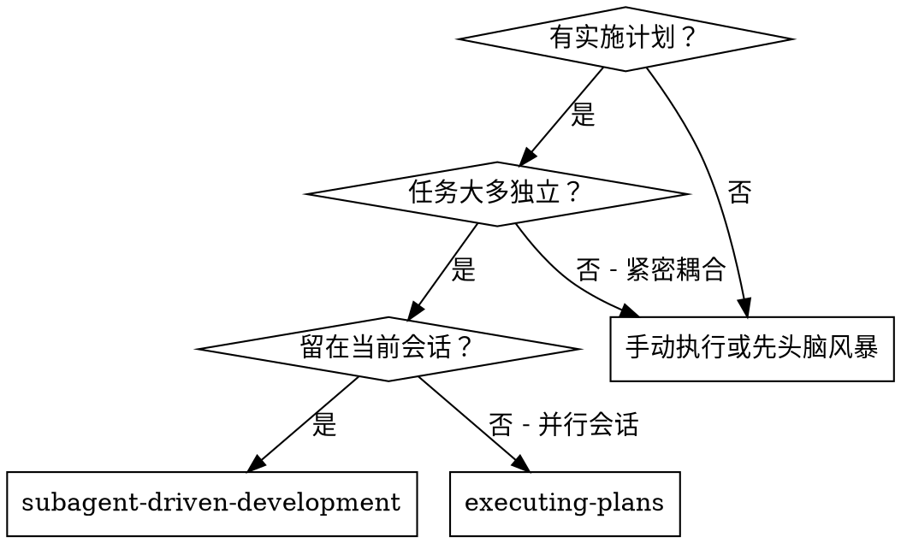
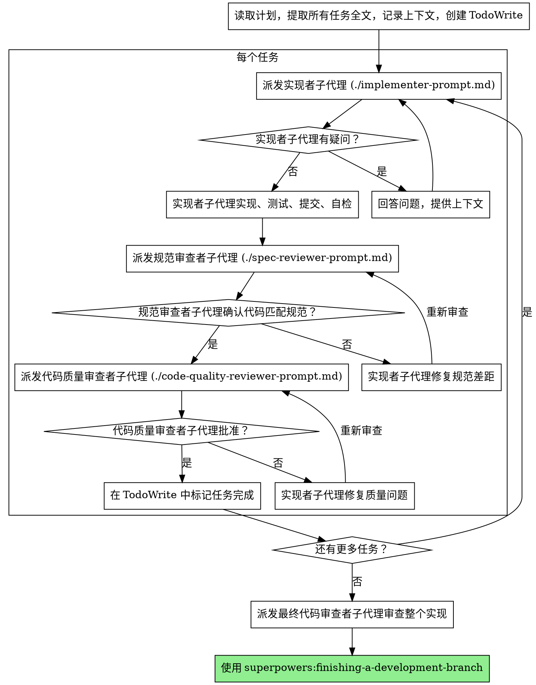

# 子代理驱动开发

通过为每个任务分发全新的子代理来执行计划，每个任务后有两阶段审查：先规范合规审查，再代码质量审查。

**为何使用子代理：** 你将任务委托给具有隔离上下文的专门代理。通过精确构建他们的指令和上下文，确保他们保持专注并成功完成任务。他们不应继承你会话的上下文或历史——你构建他们所需的确切内容。这也为你自己的上下文保留空间用于协调工作。

**核心原则：每个任务新子代理 + 两阶段审查（先规范后质量）= 高质量，快速迭代**

## 适用时机



**对比执行计划（并行会话）：**
- 同一会话（无上下文切换）
- 每个任务新子代理（无上下文污染）
- 每个任务后两阶段审查：先规范合规，再代码质量
- 更快迭代（任务间无人工介入）

## 流程



## 模型选择

使用能处理每个角色的最小能力模型以节省成本并提高速度。

**机械实现任务**（隔离函数、清晰规范、1-2 文件）：使用快速、便宜的模型。当计划规范良好时，大多数实现任务是机械性的。

**集成和判断任务**（多文件协调、模式匹配、调试）：使用标准模型。

**架构、设计和审查任务**：使用最强大的可用模型。

**任务复杂度信号：**
- Touches 1-2 files with a complete spec → cheap model
- Touches multiple files with integration concerns → standard model
- Requires design judgment or broad codebase understanding → most capable model

## 处理实现者状态

实现者子代理报告四种状态之一。适当处理每种：

**DONE：** 进入规范合规审查。

**DONE_WITH_CONCERNS：** 实现者完成工作但标记疑虑。在继续之前阅读疑虑。如果疑虑关于正确性或范围，在审查前解决它们。如果它们是观察（例如 "this file is getting large"），记录它们并继续审查。

**NEEDS_CONTEXT：** 实现者需要未提供的信息。提供缺失上下文并重新分发。

**BLOCKED：** 实现者无法完成任务。评估阻塞：
1. If it's a context problem, provide more context and re-dispatch with the same model
2. If the task requires more reasoning, re-dispatch with a more capable model
3. If the task is too large, break it into smaller pieces
4. If the plan itself is wrong, escalate to the human

**切勿**忽略升级或强制同一模型无更改重试。如果实现者说它卡住了，某些东西需要改变。

## 提示模板

- `./implementer-prompt.md` - 分发实现者子代理
- `./spec-reviewer-prompt.md` - 分发规范合规审查子代理
- `./code-quality-reviewer-prompt.md` - 分发代码质量审查子代理

## 示例工作流

```
你：我正在使用子代理驱动开发来执行此计划。

[Read plan file once: docs/superpowers/plans/feature-plan.md]
[Extract all 5 tasks with full text and context]
[Create TodoWrite with all tasks]

Task 1: Hook installation script

[Get Task 1 text and context (already extracted)]
[Dispatch implementation subagent with full task text + context]

Implementer: "Before I begin - should the hook be installed at user or system level?"

你： "User level (~/.config/superpowers/hooks/)"

Implementer: "Got it. Implementing now..."
[Later] Implementer:
  - Implemented install-hook command
  - Added tests, 5/5 passing
  - Self-review: Found I missed --force flag, added it
  - Committed

[Dispatch spec compliance reviewer]
Spec reviewer: ✅ Spec compliant - all requirements met, nothing extra

[Get git SHAs, dispatch code quality reviewer]
Code reviewer: Strengths: Good test coverage, clean. Issues: None. Approved.

[Mark Task 1 complete]

Task 2: Recovery modes

[Get Task 2 text and context (already extracted)]
[Dispatch implementation subagent with full task text + context]

Implementer: [No questions, proceeds]
Implementer:
  - Added verify/repair modes
  - 8/8 tests passing
  - Self-review: All good
  - Committed

[Dispatch spec compliance reviewer]
Spec reviewer: ❌ Issues:
  - Missing: Progress reporting (spec says "report every 100 items")
  - Extra: Added --json flag (not requested)

[Implementer fixes issues]
Implementer: Removed --json flag, added progress reporting

[Spec reviewer reviews again]
Spec reviewer: ✅ Spec compliant now

[Dispatch code quality reviewer]
Code reviewer: Strengths: Solid. Issues (Important): Magic number (100)

[Implementer fixes]
Implementer: Extracted PROGRESS_INTERVAL constant

[Code reviewer reviews again]
Code reviewer: ✅ Approved

[Mark Task 2 complete]

...

[After all tasks]
[Dispatch final code-reviewer]
Final reviewer: All requirements met, ready to merge

Done!
```

## 优势

**对比手动执行：**
- Subagents follow TDD naturally
- Fresh context per task (no confusion)
- Parallel-safe (subagents don't interfere)
- Subagent can ask questions (before AND during work)

**对比执行计划：**
- Same session (no handoff)
- Continuous progress (no waiting)
- Review checkpoints automatic

**效率提升：**
- No file reading overhead (controller provides full text)
- Controller curates exactly what context is needed
- Subagent gets complete information upfront
- Questions surfaced before work begins (not after)

**质量门禁：**
- Self-review catches issues before handoff
- Two-stage review: spec compliance, then code quality
- Review loops ensure fixes actually work
- Spec compliance prevents over/under-building
- Code quality ensures implementation is well-built

**成本：**
- More subagent invocations (implementer + 2 reviewers per task)
- Controller does more prep work (extracting all tasks upfront)
- Review loops add iterations
- But catches issues early (cheaper than debugging later)

## 警示信号

**切勿：**
- Start implementation on main/master branch without explicit user consent
- Skip reviews (spec compliance OR code quality)
- Proceed with unfixed issues
- Dispatch multiple implementation subagents in parallel (conflicts)
- Make subagent read plan file (provide full text instead)
- Skip scene-setting context (subagent needs to understand where task fits)
- Ignore subagent questions (answer before letting them proceed)
- Accept "close enough" on spec compliance (spec reviewer found issues = not done)
- Skip review loops (reviewer found issues = implementer fixes = review again)
- Let implementer self-review replace actual review (both are needed)
- **Start code quality review before spec compliance is ✅** (wrong order)
- Move to next task while either review has open issues

**如果子代理提问：**
- Answer clearly and completely
- Provide additional context if needed
- Don't rush them into implementation

**如果审查员发现问题：**
- Implementer (same subagent) fixes them
- Reviewer reviews again
- Repeat until approved
- Don't skip the re-review

**如果子代理失败任务：**
- Dispatch fix subagent with specific instructions
- Don't try to fix manually (context pollution)

## 集成

**必需工作流技能：**
- **superpowers:using-git-worktrees** — 必需：开始前设置隔离工作空间
- **superpowers:writing-plans** — 创建此技能执行的计划
- **superpowers:requesting-code-review** — 审查子代理的代码审查模板
- **superpowers:finishing-a-development-branch** — 所有任务完成后完成开发

**子代理应使用：**
- **superpowers:test-driven-development** — 子代理对每个任务遵循 TDD

**替代工作流：**
- **superpowers:executing-plans** — 用于并行会话而非同会话执行