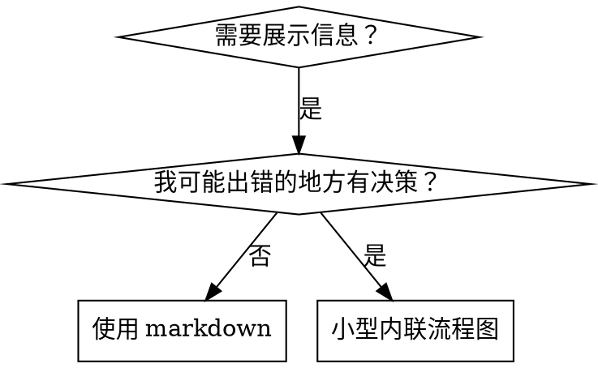

# 编写技能

## 概述

**编写技能就是将测试驱动开发应用于过程文档。**

**个人技能存放在代理特定目录（Claude Code 用 `~/.claude/skills`，Codex 用 `~/.agents/skills/`）**

你编写测试案例（带子代理的压力场景），观察它们失败（基线行为），编写技能（文档），观察测试通过（代理合规），并重构（堵住漏洞）。

**核心原则：** 如果你没有观察过代理在没有技能时是如何失败的，你就不知道技能是否教授了正确的内容。

**必读背景：** 使用此技能前，你必须理解 superpowers:test-driven-development。那个技能定义了基本的 RED-GREEN-REFACTOR 循环。本技能将 TDD 适配到文档。

**官方指南：** 关于 Anthropic 官方技能编写最佳实践，请参阅 anthropic-best-practices.md。此文档提供补充本技能中 TDD 专注方法的额外模式和指南。

## 什么是技能？

**技能**是已验证技术、模式或工具的参考指南。技能帮助未来的 Claude 实例找到并应用有效方法。

**技能是：** 可复用技术、模式、工具、参考指南

**技能不是：** 关于你如何一次解决问题的叙述

## 技能的 TDD 映射

| TDD 概念 | 技能创建 |
|-------------|----------------|
| **测试案例** | 带子代理的压力场景 |
| **生产代码** | 技能文档 (SKILL.md) |
| **测试失败 (RED)** | 代理在没有技能时违反规则（基线） |
| **测试通过 (GREEN)** | 代理在有技能时合规 |
| **重构** | 在保持合规的同时堵住漏洞 |
| **先写测试** | 在编写技能前运行基线场景 |
| **观察失败** | 逐字记录代理使用的合理化借口 |
| **最小代码** | 编写解决那些特定违规的技能 |
| **观察通过** | 验证代理现在合规 |
| **重构循环** | 发现新合理化 → 填补 → 重新验证 |

整个技能创建过程遵循 RED-GREEN-REFACTOR。

## 何时创建技能

**创建时机：**
- 技术对你来说不是直观显而易见的
- 你会跨项目再次引用此内容
- 模式广泛适用（非项目特定）
- 其他人会受益

**不要为以下创建：**
- 一次性解决方案
- 其他地方良好记录的标准实践
- 项目特定约定（放入 CLAUDE.md）
- 机械约束（如果可用正则/验证强制执行，自动化它——将文档留给判断调用）

## 技能类型

### 技术
有步骤可遵循的具体方法（condition-based-waiting、root-cause-tracing）

### 模式
思考问题的方式（flatten-with-flags、test-invariants）

### 参考
API 文档、语法指南、工具文档（office docs）

## 目录结构


```
skills/
  skill-name/
    SKILL.md              # Main reference (required)
    supporting-file.*     # Only if needed
```

**扁平命名空间** - 所有技能在一个可搜索命名空间中

**为以下分开文件：**
1. **重量级参考**（100+ 行）- API 文档、综合语法
2. **可复用工具** - 脚本、工具、模板

**保持内联：**
- 原则和概念
- 代码模式（< 50 行）
- 其他所有

## SKILL.md 结构

**Frontmatter (YAML)：**
- 两个必需字段：`name` 和 `description`（见 [agentskills.io/specification](https://agentskills.io/specification) 了解所有支持字段）
- 总共最多 1024 字符
- `name`：只用字母、数字和连字符（无括号、特殊字符）
- `description`：第三人称，只描述何时使用（不描述做什么）
  - 以"Use when..."开始以聚焦触发条件
  - 包含特定症状、情况和上下文
  - **永远不要总结技能的流程或工作流**（见 CSO 章节了解原因）
  - 尽可能保持在 500 字符以内

```markdown
---
name: Skill-Name-With-Hyphens
description: [特定触发条件和症状]时使用
---

# Skill Name

## Overview
这是什么？核心原则在 1-2 句话中。

## When to Use
[如果决策不明显，则小型内联流程图]

带症状和用例的要点列表
何时不要使用

## Core Pattern (for techniques/patterns)
前后代码对比

## Quick Reference
扫描常见操作的表格或要点

## Implementation
简单模式的内联代码
链接到文件用于重量级参考或可复用工具

## Common Mistakes
什么出错 + 修复方法

## Real-World Impact (optional)
具体结果
```


## Claude 搜索优化 (CSO)

**对发现至关重要：** 未来 Claude 需要找到你的技能

### 1. 丰富的描述字段

**目的：** Claude 读取描述来决定为给定任务加载哪些技能。让它回答："我现在应该读这个技能吗？"

**格式：** 以"Use when..."开始以聚焦触发条件

**关键：描述 = 何时使用，而非技能做什么**

描述应该只描述触发条件。不要在描述中总结技能的流程或工作流。

**为什么重要：** 测试揭示当描述总结技能工作流时，Claude 可能遵循描述而非读取完整技能内容。一个描述说"任务间代码审查"导致 Claude 只做一次审查，尽管技能的流程图清楚显示两次审查（规范合规然后代码质量）。

当描述被改为只是"Use when executing implementation plans with independent tasks"（无工作流总结），Claude 正确读取流程图并遵循两阶段审查流程。

**陷阱：** 总结工作流的描述创造 Claude 会走的捷径。技能主体变成 Claude 跳过的文档。

```yaml
# ❌ 坏：总结工作流 - Claude 可能遵循这个而非读取技能
description: 执行计划时使用 — 每个任务派发子代理，任务间有代码审查

# ❌ 坏：太多过程细节
description: TDD时使用 — 先写测试，看它失败，写最小代码，重构

# ✅ 好：只有触发条件，无工作流总结
description: 在当前会话中执行带有独立任务的实施计划时使用

# ✅ 好：只有触发条件
description: 实现任何功能或bugfix时使用，在编写实现代码前
```

**内容：**
- 使用标记此技能适用的具体触发器、症状和情况
- 描述问题（竞态条件、不一致行为）而非语言特定症状（setTimeout、sleep）
- 保持触发器技术无关，除非技能本身是技术特定的
- 如果技能是技术特定的，在触发器中明确说明
- 用第三人称编写（注入到系统提示）
- **永远不要总结技能的流程或工作流**

```yaml
# ❌ 坏：太抽象、模糊、不包括何时使用
description: 用于异步测试

# ❌ 坏：第一人称
description: 我可以在异步测试不稳定时帮助你

# ❌ 坏：提及技术但技能不特定于它
description: 测试使用 setTimeout/sleep 且不稳定时使用

# ✅ 好：以"Use when"开始，描述问题，无工作流
description: 测试有竞态条件、时序依赖、或不一致通过/失败时使用

# ✅ 好：技术特定技能带明确触发器
description: 使用 React Router 并处理认证重定向时使用
```

### 2. 关键词覆盖

使用 Claude 会搜索的词：
- 错误消息："Hook timed out"、"ENOTEMPTY"、"race condition"
- 症状："flaky"、"hanging"、"zombie"、"pollution"
- 同义词："timeout/hang/freeze"、"cleanup/teardown/afterEach"
- 工具：实际命令、库名、文件类型

### 3. 描述性命名

**使用主动语态，动词优先：**
- ✅ `creating-skills` 不是 `skill-creation`
- ✅ `condition-based-waiting` 不是 `async-test-helpers`

### 4. Token 效率（关键）

**问题：** getting-started 和经常引用的技能加载到每个对话。每个 token 都重要。

**目标字数：**
- getting-started 工作流：每个 <150 词
- 经常加载的技能：总共 <200 词
- 其他技能：<500 词（仍要简洁）

**技术：**

**将详情移到工具帮助：**
```bash
# ❌ 坏：在 SKILL.md 中记录所有标志
search-conversations supports --text, --both, --after DATE, --before DATE, --limit N

# ✅ 好：引用 --help
search-conversations supports multiple modes and filters. Run --help for details.
```

**使用交叉引用：**
```markdown
# ❌ 坏：重复工作流详情
When searching, dispatch subagent with template...
[20 lines of repeated instructions]

# ✅ 好：引用其他技能
Always use subagents (50-100x context savings). REQUIRED: Use [other-skill-name] for workflow.
```

**压缩示例：**
```markdown
# ❌ 坏：冗长示例（42 词）
your human partner: "How did we handle authentication errors in React Router before?"
You: I'll search past conversations for React Router authentication patterns.
[Dispatch subagent with search query: "React Router authentication error handling 401"]

# ✅ 好：最小示例（20 词）
Partner: "How did we handle auth errors in React Router?"
You: Searching...
[Dispatch subagent → synthesis]
```

**消除冗余：**
- 不要重复交叉引用技能中的内容
- 不要解释命令显而易见的内容
- 不要包含相同模式的多个示例

**验证：**
```bash
wc -w skills/path/SKILL.md
# getting-started 工作流：目标是每个 <150
# 其他经常加载：目标是总共 <200
```

**按你做的或核心洞察命名：**
- ✅ `condition-based-waiting` > `async-test-helpers`
- ✅ `using-skills` 不是 `skill-usage`
- ✅ `flatten-with-flags` > `data-structure-refactoring`
- ✅ `root-cause-tracing` > `debugging-techniques`

**动名词 (-ing) 对过程很好：**
- `creating-skills`、`testing-skills`、`debugging-with-logs`
- 主动，描述你正在采取的行动

### 4. 交叉引用其他技能

**编写引用其他技能的文档时：**

只用技能名称，带明确要求标记：
- ✅ 好：`**REQUIRED SUB-SKILL:** Use superpowers:test-driven-development`
- ✅ 好：`**REQUIRED BACKGROUND:** You MUST understand superpowers:systematic-debugging`
- ❌ 坏：`See skills/testing/test-driven-development`（不清楚是否必需）
- ❌ 坏：`@skills/testing/test-driven-development/SKILL.md`（强制加载，消耗上下文）

**为什么不用 @ 链接：** `@` 语法强制立即加载文件，在你需要它们前消耗 200k+ 上下文。

## 流程图使用



**流程图只用于：**
- 不明显的决策点
- 你可能过早停止的过程循环
- "何时用 A vs B"决策

**永远不要用流程图：**
- 参考材料 → 表格、列表
- 代码示例 → Markdown 块
- 线性指令 → 编号列表
- 无语义意义的标签（step1、helper2）

见 @graphviz-conventions.dot 了解 graphviz 样式规则。

**为你的合作伙伴可视化：** 使用此目录中的 `render-graphs.js` 将技能的流程图渲染为 SVG：
```bash
./render-graphs.js ../some-skill           # Each diagram separately
./render-graphs.js ../some-skill --combine # All diagrams in one SVG
```

## 代码示例

**一个优秀示例胜过多个平庸示例**

选择最相关语言：
- 测试技术 → TypeScript/JavaScript
- 系统调试 → Shell/Python
- 数据处理 → Python

**好示例：**
- 完整可运行
- 解释为什么的良好注释
- 来自真实场景
- 清晰显示模式
- 可适配（非通用模板）

**不要：**
- 用 5+ 语言实现
- 创建填空模板
- 编写人为示例

你擅长移植 - 一个伟大示例就够了。

## 文件组织

### 自包含技能
```
defense-in-depth/
  SKILL.md    # Everything inline
```
时机：所有内容适合，无重量级参考需要

### 带可复用工具的技能
```
condition-based-waiting/
  SKILL.md    # Overview + patterns
  example.ts  # Working helpers to adapt
```
时机：工具是可复用代码，不只是叙述

### 带重量级参考的技能
```
pptx/
  SKILL.md       # Overview + workflows
  pptxgenjs.md   # 600 lines API reference
  ooxml.md       # 500 lines XML structure
  scripts/       # Executable tools
```
时机：参考材料太大不适合内联

## 铁律（与 TDD 相同）

```
NO SKILL WITHOUT A FAILING TEST FIRST
```

这适用于新技能和对现有技能的编辑。

测试前编写技能？删除它。重来。
没测试就编辑技能？同样违规。

**无例外：**
- 不是为"简单添加"
- 不是为"只是添加一个章节"
- 不是为"文档更新"
- 不要保留未测试更改作为"参考"
- 不要在运行测试时"适应"
- 删除意味着删除

**必读背景：** superpowers:test-driven-development 技能解释为什么这重要。相同原则适用于文档。

## 测试所有技能类型

不同技能类型需要不同测试方法：

### 强制纪律技能（规则/要求）

**示例：** TDD、verification-before-completion、designing-before-coding

**测试用：**
- 学术问题：他们理解规则吗？
- 压力场景：他们在压力下合规吗？
- 组合多重压力：时间 + 沉没成本 + 疲惫
- 识别合理化借口并添加明确对策

**成功标准：** 代理在最大压力下遵循规则

### 技术技能（如何做指南）

**示例：** condition-based-waiting、root-cause-tracing、defensive-programming

**测试用：**
- 应用场景：他们能正确应用技术吗？
- 变化场景：他们处理边缘情况吗？
- 缺失信息测试：指令有缺口吗？

**成功标准：** 代理成功将技术应用于新场景

### 模式技能（心智模型）

**示例：** reducing-complexity、信息隐藏概念

**测试用：**
- 识别场景：他们识别何时模式适用吗？
- 应用场景：他们能使用心智模型吗？
- 反例：他们知道何时不应用吗？

**成功标准：** 代理正确识别何时/如何应用模式

### 参考技能（文档/API）

**示例：** API 文档、命令参考、库指南

**测试用：**
- 检索场景：他们能找到正确信息吗？
- 应用场景：他们能正确使用找到的内容吗？
- 缺口测试：常见用例覆盖了吗？

**成功标准：** 代理找到并正确应用参考信息

## 跳过测试的常见合理化借口

| 借口 | 现实 |
|--------|---------|
| "技能明显清晰" | 对你清晰 ≠ 对其他代理清晰。测试它。 |
| "这只是参考" | 参考可能有缺口、不清晰章节。测试检索。 |
| "测试是过度" | 未测试技能有问题。总是。15 分钟测试节省数小时。 |
| "有问题再测试" | 问题 = 代理不能用技能。部署前测试。 |
| "测试太繁琐" | 测试比在生产中调试坏技能更不繁琐。 |
| "我确信它好" | 过度自信保证有问题。无论如何测试。 |
| "学术审查够了" | 阅读 ≠ 使用。测试应用场景。 |
| "没时间测试" | 部署未测试技能浪费更多时间稍后修复。 |

**所有这些意味着：部署前测试。无例外。**

## 技能防弹化抵抗合理化

强制纪律的技能（如 TDD）需要抵抗合理化。代理很聪明，会在压力下找到漏洞。

**心理学说明：** 理解说服技术为什么有效帮助你系统应用它们。见 persuasion-principles.md 了解研究基础（Cialdini, 2021; Meincke 等, 2025）关于权威、承诺、稀缺、社会认同和统一原则。

### 明确堵住每个漏洞

不只陈述规则 - 禁止特定绕过：

<Bad>
```markdown
Write code before test? Delete it.
```
</Bad>

<Good>
```markdown
Write code before test? Delete it. Start over.

**No exceptions:**
- Don't keep it as "reference"
- Don't "adapt" it while writing tests
- Don't look at it
- Delete means delete
```
</Good>

### 处理"精神 vs 字面"论点

尽早添加基本原则：

```markdown
**Violating the letter of the rules is violating the spirit of the rules.**
```

这切断整类"我在遵循精神"合理化借口。

### 构建合理化表格

从基线测试捕获合理化借口（见下方测试章节）。代理做的每个借口进入表格：

```markdown
| Excuse | Reality |
|--------|---------|
| "Too simple to test" | Simple code breaks. Test takes 30 seconds. |
| "I'll test after" | Tests passing immediately prove nothing. |
| "Tests after achieve same goals" | Tests-after = "what does this do?" Tests-first = "what should this do?" |
```

### 创建红旗列表

使代理在合理化时容易自检：

```markdown
## Red Flags - STOP and Start Over

- Code before test
- "I already manually tested it"
- "Tests after achieve the same purpose"
- "It's about spirit not ritual"
- "This is different because..."

**All of these mean: Delete code. Start over with TDD.**
```

### 为违规症状更新 CSO

添加到描述：你即将违反规则的症状：

```yaml
description: 实现任何功能或bugfix时使用，在编写实现代码前
```

## 技能的 RED-GREEN-REFACTOR

遵循 TDD 循环：

### RED：编写失败测试（基线）

在没有技能的情况下用子代理运行压力场景。记录确切行为：
- 他们做了什么选择？
- 他们用了什么合理化借口（逐字）？
- 哪些压力触发违规？

这是"观察测试失败" - 你必须在编写技能前看到代理自然做什么。

### GREEN：编写最小技能

编写解决那些特定合理化借口的最小技能。不要为假设情况添加额外内容。

在有技能的情况下运行相同场景。代理现在应该合规。

### REFACTOR：堵住漏洞

代理发现新的合理化借口？添加明确对策。重新测试直到防弹。

**测试方法：** 见 @testing-skills-with-subagents.md 了解完整测试方法：
- 如何编写压力场景
- 压力类型（时间、沉没成本、权威、疲惫）
- 系统填补漏洞
- 元测试技术

## 反模式

### ❌ 叙述示例
"In session 2025-10-03, we found empty projectDir caused..."
**为什么坏：** 太特定，不可复用

### ❌ 多语言稀释
example-js.js, example-py.py, example-go.go
**为什么坏：** 平庸质量，维护负担

### ❌ 流程图中的代码
```dot
step1 [label="import fs"];
step2 [label="read file"];
```
**为什么坏：** 不能复制粘贴，难读

### ❌ 通用标签
helper1, helper2, step3, pattern4
**为什么坏：** 标签应有语义意义

## STOP：在进入下一个技能前

**编写任何技能后，你必须 STOP 并完成部署过程。**

**不要：**
- 不测试每个批量创建多个技能
- 当前技能验证前进入下一个
- 因为"批量更高效"跳过测试

**下方部署检查清单对每个技能是强制性的。**

部署未测试技能 = 部署未测试代码。这是质量标准违规。

## 技能创建检查清单（TDD 适配）

**重要：用 TodoWrite 为下方每个检查清单项创建待办。**

**RED 阶段 - 编写失败测试：**
- [ ] 创建压力场景（强制纪律技能用 3+ 组合压力）
- [ ] 在没有技能的情况下运行场景 - 逐字记录基线行为
- [ ] 识别合理化借口/失败中的模式

**GREEN 阶段 - 编写最小技能：**
- [ ] 名称只用字母、数字、连字符（无括号/特殊字符）
- [ ] YAML frontmatter 带必需 `name` 和 `description` 字段（最多 1024 字符；见 [spec](https://agentskills.io/specification))
- [ ] 描述以"Use when..."开始并包含特定触发器/症状
- [ ] 描述用第三人称编写
- [ ] 整体关键词用于搜索（错误、症状、工具）
- [ ] 清晰概览带核心原则
- [ ] 解决 RED 中识别的特定基线失败
- [ ] 代码内联或链接到单独文件
- [ ] 一个优秀示例（非多语言）
- [ ] 在有技能的情况下运行场景 - 验证代理现在合规

**REFACTOR 阶段 - 填补漏洞：**
- [ ] 从测试中识别新的合理化借口
- [ ] 添加明确对策（如果是强制纪律技能）
- [ ] 从所有测试迭代构建合理化表格
- [ ] 创建红旗列表
- [ ] 重新测试直到防弹

**质量检查：**
- [ ] 只在决策不明显时小型流程图
- [ ] 快速参考表格
- [ ] 常见错误章节
- [ ] 无叙述故事
- [ ] 支持文件只用于工具或重量级参考

**部署：**
- [ ] 将技能提交到 git 并推送到你的 fork（如果配置）
- [ ] 考虑通过 PR 贡献回（如果广泛有用）

## 发现工作流

未来 Claude 如何找到你的技能：

1. **遇到问题**（"测试不稳定"）
3. **找到技能**（描述匹配）
4. **扫描概览**（这相关吗？）
5. **读取模式**（快速参考表格）
6. **加载示例**（只在实现时）

**为此流程优化** - 尽早和经常放置可搜索词。

## 底线

**创建技能就是过程文档的 TDD。**

相同铁律：没有技能在没有失败测试前。
相同循环：RED（基线）→ GREEN（编写技能）→ REFACTOR（堵住漏洞）。
相同收益：更好质量、更少惊喜、防弹结果。

如果你遵循代码的 TDD，遵循技能的 TDD。它是应用于文档的相同纪律。